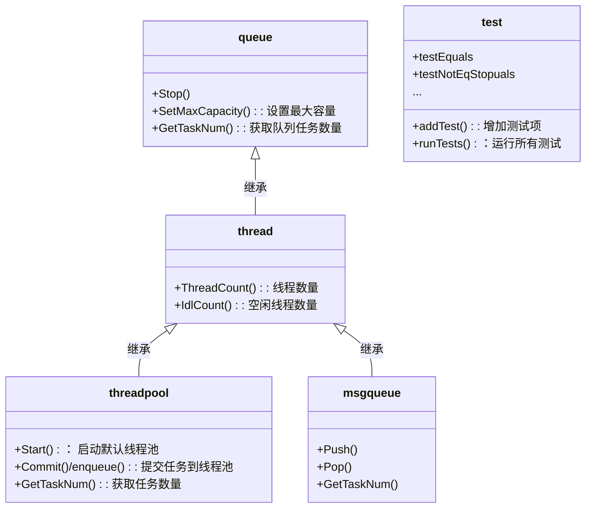

# 线程池

一般利用多线程来进行任务处理，采用"即时创建，即时销毁"的策略。

提交给线程的任务是执行时间较短，而且执行次数非常频繁，那么服务器就将处于一个不停的创建线程和销毁线程的状态。

> 完成一项任务需要的时间=创建线程时间T1+线程执行任务时间T2+销毁线程时间T3，如果T1+T3的时间远大于T2，通常就可以考虑采取线程池来提高服务器的性能。

线程池：**采用有限的线程个数处理无限的任务。**

>   1. 避免了在处理短时间任务时创建与销毁线程的代价；
>
>   2. 在大批量并发任务中，可以更合理的使用系统资源，进行削峰平谷，保证系统运行的稳定性；

## 线程池原理

在应用程序启动之后，就马上创建一定数量的线程，放入空闲的队列中。这些线程都是处于阻塞状态，这些线程只占一点内存，不占用CPU。当任务到来后，线程池将选择一个空闲的线程，将任务传入此线程中运行。

（**动态线程池**）当所有的线程都处在处理任务的时候，线程池将自动创建一定的数量的新线程，用于处理更多的任务。执行任务完成之后线程并不退出，而是继续在线程池中等待下一次任务。当大部分线程处于阻塞状态时，线程池将自动销毁一部分的线程，回收系统资源。

一般利用**条件变量**和**互斥锁**来实现线程池，模型可以参考生产消费者模型。

### 线程池组成

- 完成任务的一个或多个线程
- 要求执行线程的任务队列
- 用于调度管理的管理线程

### 数据结构

链表或者数组：用于存储线程池中的线程。 `vector`

队列：用于存储需要放入线程池中执行的任务。`queue`

互斥量：线程同步。`mutex`

条件变量：当有任务需要执行时，用于通知正在等待的线程从任务队列中取出任务执行。`condition_variable`

### 线程池大小

高并发、任务执行时间短的业务或计算密集型任务，线程池线程数设置为CPU核数**N+1**，减少线程上下文的切换。

并发不高、任务执行时间长的业务或IO密集型的任务，因为IO操作并不占用CPU，线程池线程数设置为**2*N**。
　　

## 基于标准库

**thread库**：线程

**mutex库**：互斥量

**condition_variable库**：条件量

**future库**：从线程中返回异步任务结果，一般需要依靠**全局变量**，从安全角度看不妥。

C++11提供了std::future类模板。future对象提供访问异步操作结果的机制，从异步任务中返回结果。

### 固定大小线程池

`ThreadPool.h`

1. 任务无需继承接口，构造时初始化线程数量；
2. 支持变参lambada表达式、全局函数、类静态成员函数；
3. 可以获取执行返回值。

```c++
#ifndef THREAD_POOL_H
#define THREAD_POOL_H

#include <vector>
#include <queue>
#include <memory>
#include <thread>             // std::thread 线程相关
#include <mutex>              // std::mutex, std::unique_lock 互斥量
#include <condition_variable> // 条件量，用于线程间通信，唤醒阻塞线程
#include <future>             // std::future 获取线程数据
#include <functional>         // std::function 函数对象
#include <stdexcept>          // std::runtime_error   标准异常

class ThreadPool // 线程池类
{
public:
    ThreadPool(size_t); // 构造函数，初始化线程池
    //一个enqueue模板函数 返回std::future<type>, type利用了运行时检测推断出类型
    //可以提交变参函数或拉姆达表达式的匿名函数执行,可以获取执行返回值
    template <class F, class... Args>                              // 模板函数，接受任意参数
    auto enqueue(F &&f, Args &&...args)                            // 将任务添加到任务队列中
        -> std::future<typename std::result_of<F(Args...)>::type>; // 返回任务执行结果
    ~ThreadPool();                                                 // 析构函数，终止线程池

private:
    std::vector<std::thread> workers;        // 工作线程
    std::queue<std::function<void()>> tasks; // 任务队列

    // synchronization
    std::mutex queue_mutex;            // 互斥量，用于线程间同步
    std::condition_variable condition; // 条件量，用于线程间同步
    bool stop;                         // 线程池是否终止
};

// the constructor just launches some amount of workers
inline ThreadPool::ThreadPool(size_t threads)
    : stop(false) // 初始化线程池
{
    for (size_t i = 0; i < threads; ++i)
        workers.emplace_back(
            [this]
            {
                for (;;)
                {
                    std::function<void()> task; // 任务函数对象
                    {
                        std::unique_lock<std::mutex> lock(this->queue_mutex); // 互斥量，用于线程间同步
                        this->condition.wait(lock,
                                             [this]
                                             { return this->stop || !this->tasks.empty(); }); // 等待条件量，等待任务队列不为空（condition是返回false才会wait）
                        if (this->stop && this->tasks.empty())                                // 如果线程池终止，且任务队列为空
                            return;
                        task = std::move(this->tasks.front()); // 取出任务队列中的第一个任务
                        this->tasks.pop();                     // 删除任务队列中的第一个任务
                    }
                    task(); // 执行任务
                }
            });
}

// add new work item to the pool
template <class F, class... Args>
auto ThreadPool::enqueue(F &&f, Args &&...args)               // 接受任意参数
    -> std::future<typename std::result_of<F(Args...)>::type> // 返回任务执行结果
{
    using return_type = typename std::result_of<F(Args...)>::type;

    auto task = std::make_shared<std::packaged_task<return_type()>>(
        std::bind(std::forward<F>(f), std::forward<Args>(args)...));

    std::future<return_type> res = task->get_future(); // 获取任务执行结果
    {                                                  // 加锁入队
        std::unique_lock<std::mutex> lock(queue_mutex);

        // don't allow enqueueing after stopping the pool
        if (stop)
            throw std::runtime_error("enqueue on stopped ThreadPool");

        tasks.emplace([task]()
                      { (*task)(); }); // 将任务添加到任务队列中
    }
    condition.notify_one(); // 通知工作线程
    return res;
}

// the destructor joins all threads
inline ThreadPool::~ThreadPool()
{
    {
        std::unique_lock<std::mutex> lock(queue_mutex);
        stop = true;
    }
    condition.notify_all();             // 唤醒所有线程
    for (std::thread &worker : workers) // 等待所有线程结束
        worker.join();
}

#endif
```

一个使用示例：

```c++
#include <iostream>
#include <vector>
#include <chrono>
#include "ThreadPool.h"

int main()
{

    ThreadPool pool(4);
    std::vector<std::future<int>> results;

    for (int i = 0; i < 5; ++i)
    {
        results.emplace_back(
            pool.enqueue([i]
                         {
                std::cout << std::this_thread::get_id() << std::endl;
                std::this_thread::sleep_for(std::chrono::seconds(2));
                return i; }));
    }

    for (auto &&result : results)
        std::cout << result.get() << std::endl;

    return 0;
}
// g++ example3.cpp -o example3 -pthread
```

### 动态线程池

PS：相较于固定数量线程，动态线程池主要将ThreadPool构造函数中的线程初始化部分抽象出来，形成一个addThread函数。

> - [x] 核心线程数(core_threads)：线程池中拥有的最少线程个数，初始化时就会创建好的线程，常驻于线程池。
>
> - [x] 最大线程个数(max_threads)：线程池中拥有的最大线程个数，max_threads>=core_threads，当任务的个数太多线程池执行不过来时，内部就会创建更多的线程用于执行更多的任务，内部线程数不会超过max_threads，多创建出来的线程在一段时间内没有执行任务则会自动被回收掉，最终线程个数保持在核心线程数。
>
> - [x] 可获取当前线程池中线程的总个数。
>
> - [x] 可获取当前线程池中空闲线程的个数。
>
非必要：
>
> - [ ] 开启线程池功能的开关。
>
> - [ ] 关闭线程池功能的开关，可以选择是否立即关闭，立即关闭线程池时，当前线程池里缓存的任务不会被执行。
>
> - [ ] 超时时间(time_out)：如上所述，多创建出来的线程在time_out时间内没有执行任务就会被回收。

```c++
#pragma once
#ifndef THREAD_POOL_H
#define THREAD_POOL_H

#include <vector>
#include <queue>
#include <atomic>
#include <future>             // std::future 获取线程数据
#include <condition_variable> // 条件量，用于线程间通信，唤醒阻塞线程
#include <thread>             // std::thread 线程相关
#include <mutex>              // std::mutex, std::unique_lock 互斥量
#include <functional>         // std::function 函数对象
#include <stdexcept>          // std::runtime_error   标准异常

namespace std
{
//线程池最大容量,应尽量设小一点
#define THREADPOOL_MAX_NUM 16
#define THREADPOOL_AUTO_GROW //动态增加线程池容量

    //线程池,可以提交变参函数或拉姆达表达式的匿名函数执行,可以获取执行返回值
    //不直接支持类成员函数, 支持类静态成员函数或全局函数,opertor()函数等
    class ThreadPool
    {
        vector<thread> _workers;        //工作线程
        queue<function<void()>> _tasks; //任务队列
        mutex _queue_mutex;             //互斥量
        condition_variable _condition;  //条件阻塞
        atomic<bool> _run{true};        //线程池是否执行
        atomic<int> _idlThrNum{0};      //空闲线程数量

    public:
        inline ThreadPool(size_t size) { addThread(size); }
        inline ~ThreadPool()
        {
            {
                unique_lock<mutex> lock(_queue_mutex);
                _run = false;
            }
            _condition.notify_all(); // 唤醒所有线程执行
            for (thread &worker : _workers)
            {
                // worker.detach(); // 让线程“自生自灭”
                if (worker.joinable())
                    worker.join(); // 等待任务结束， 前提：线程一定会执行完
            }
        }

    public:
        // 提交一个任务
        // 调用.get()获取返回值会等待任务执行完,获取返回值
        template <class F, class... Args>
        auto enqueue(F &&f, Args &&...args) -> future<decltype(f(args...))>
        {

            using return_type = decltype(f(args...));
            // typename std::result_of<F(Args...)>::type, 函数 f 的返回值类型
            auto task = make_shared<packaged_task<return_type()>>(bind(forward<F>(f), forward<Args>(args)...)); // 把函数入口及参数,打包(绑定)

            future<return_type> res = task->get_future(); // 获取任务执行结果

            {                                         // 添加任务到队列
                lock_guard<mutex> lock{_queue_mutex}; //对当前块的语句加锁  lock_guard 是 mutex 的 stack 封装类，构造的时候 lock()，析构的时候 unlock()

                if (!_run) // stoped
                    throw runtime_error("ThreadPool is stopped.");

                _tasks.emplace([task]()
                               { (*task)(); }); // push(Task{...}) 放到队列后面
            }

#ifdef THREADPOOL_AUTO_GROW
            if (_idlThrNum < 1 && _workers.size() < THREADPOOL_MAX_NUM)
                addThread(1);
#endif

            _condition.notify_one(); // 通知工作线程,唤醒一个线程执行
            return res;
        }

        //空闲线程数量
        int idlCount() { return _idlThrNum; }
        //线程数量
        int thrCount() { return _workers.size(); }

#ifndef THREADPOOL_AUTO_GROW

    private:
#endif // !THREADPOOL_AUTO_GROW
       //添加指定数量的线程
        void addThread(size_t size)
        {
            for (; _workers.size() < THREADPOOL_MAX_NUM && size > 0; --size) //增加线程数量,但不超过 预定义数量 THREADPOOL_MAX_NUM
            {
                //工作线程函数
                _workers.emplace_back(
                    [this]
                    {
                        while (_run)
                        {
                            function<void()> task; // 获取一个待执行的任务对象
                            {
                                unique_lock<mutex> lock{_queue_mutex}; // unique_lock 相比 lock_guard 的好处是：可以随时 unlock() 和 lock()
                                _condition.wait(lock,
                                                [this]
                                                { return !_run || !_tasks.empty(); }); // 等待条件量，等待任务队列不为空（condition是返回false才会wait）
                                                                                       //如果线程池终止，且任务队列为空
                                if (!_run && _tasks.empty())
                                    return;
                                task = move(_tasks.front()); // 按先进先出从队列取一个任务
                                _tasks.pop();
                            }
                            _idlThrNum--;
                            task(); //执行任务
                            _idlThrNum++;
                        }
                    });
                _idlThrNum++;
            }
        }
    };

}

#endif
```

## 基于Asio（参考）

asio官方给出了基于boost::asio的线程池实现[Recipes (think-async.com)](http://think-async.com/Asio/Recipes))

代码简单但抽象，仅参考思路。

创建一个`io_service`：

```cpp
asio::io_service io_service;
```

`run()`如果它无事可做，一些工作会阻止其功能退出：

```cpp
asio::io_service::work work(io_service);
```

启动一些工作线程：

```cpp
boost::thread_group threads;
for (std::size_t i = 0; i < my_thread_count; ++i)
  threads.create_thread(boost::bind(&asio::io_service::run, &io_service));
```

将任务发布到 `io_service`以便它们可以由工作线程执行：	

```cpp
io_service.post(boost::bind(an_expensive_calculation, 42));
io_service.post(boost::bind(a_long_running_task, 123));
```

最后，在程序退出之前关闭`io_service`并等待所有线程退出：

```cpp
io_service.post(boost::bind(an_expensive_calculation, 42));
io_service.stop();
threads.join_all();
```

# 消息队列

> 线程间通信常用方式，常用于解决经典模型生产者——消费者模型线程间的通信

> - SPSC 单生产者单消费者
> - MPSC 多生产者单消费者
> - SPMC 单生产者多消费者
> - MPMC 多生产者多消费者

- 线程池和消息都使用了队列，如阻塞队列、优先级队列；
- 使用线程池时应用服务器既充当生产者又充当消费者，也是消息队列中间件的实现者，使用消息队列时中间件、生产者、消费者可以部署在不同的应用机器上（线程池更适合非分布式的系统，消息队列适合分布式架构）；
- 消息队列自动实现消息的持久化，中间已经实现了大量功能，如消息转发、消息拒绝、消息重试，以及对消息的一些监控，例如消息的消费状态、消息的消费速率、消息内容查询等
- 使用消息队列会提升系统的复杂度，提高网络开销，需考虑网络抖动、最大队列长度、超时时间、Qos、消费者数量、Channel cache size。

## 消息传递模式

**One way**

- `push() put()`消息放入队列，队列满时阻塞。
- `push() get()`从队列中读取消息，队列为空时阻塞，直到队列中至少有一条消息可用（或者指定超时）。

**Request-response**

- 请求`request()`
- 响应`respond()`

## 实现



## 测试


